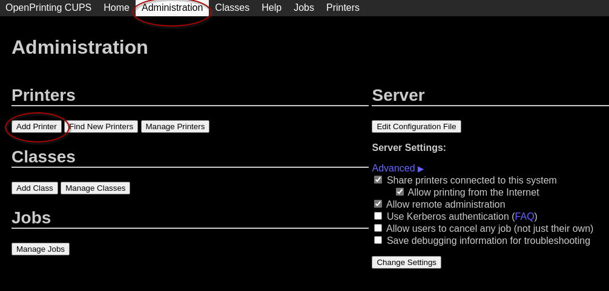
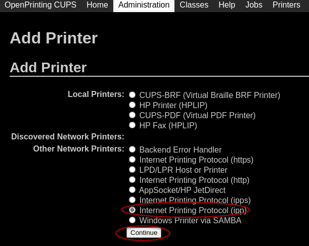
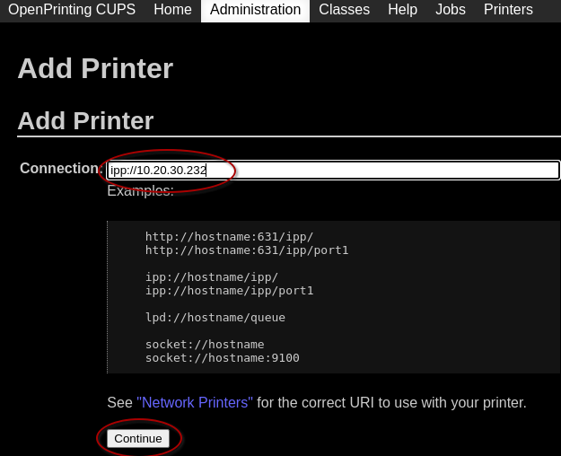
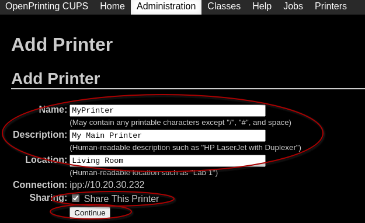
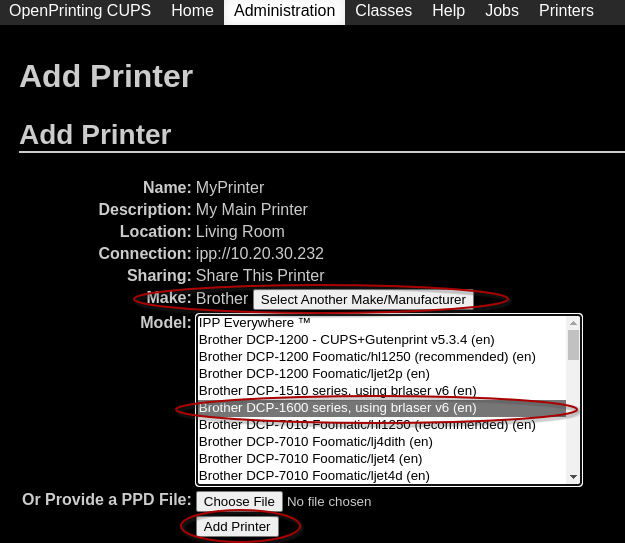
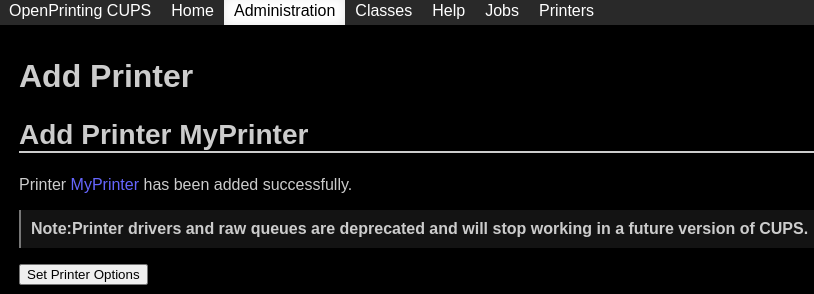
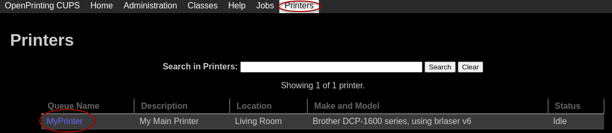
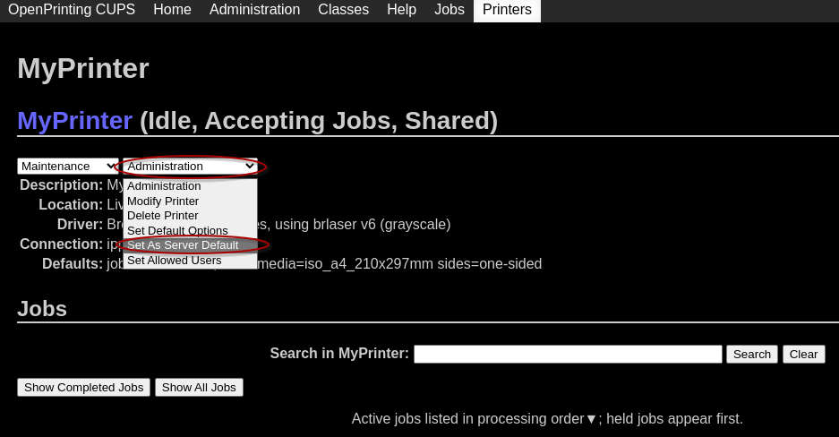

# Example CUPS configuration of network printer (Brother DCP-1610WE)

## Login to <http://127.0.0.1:1024>

## If asked for Password/User at this step input `print`/`print`

## At this point printer options can be set up clicking on "Set Printer Options" but they can be left as Default ones

## Final step is to set up printer as Default so it will not be required to add -p option and name of printer every time

## After clicking on "Set As Server Default" page will fail to load. This is ok. At this point server configuration is complete. (In case you want to return to server configuration just change port :631 to :1024 in address bar)
